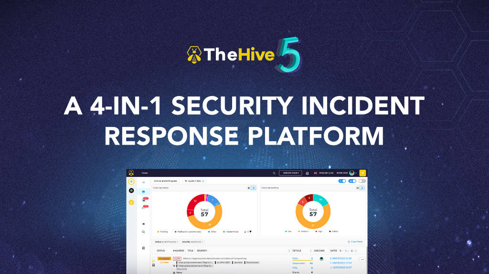

## TheHive 5 Feedback

This repository is dedicated to gather feedback and issues about [TheHive version 5](https://www.strangebee.com/thehive).
For issues concerning TheHive v4 or v3, go to [the opensource repository](https://github.com/TheHive-Project/TheHive).

### Should I post an issue ?

- If your question concerns the license or a commercial aspect, please contact us via [StrangeBee's website](https://www.strangebee.com/contact/).
- A page may already exist for your issue, have you looked at the [documentation](https://docs.strangebee.com/) ? It details common setups and deployment scenarios as well as the configuration of the platform. 
- Does your issue concerns an exploit or a security vulnerability ? If so please email us at [security@strangebee.com](mailto:security@strangebee.com)
- Did someone already asked the same issue ? Look for duplicates in this repository.

### How to post an issue

- Create an issue using the github interface: Issues > New Issue
- Choose a template (bug or feature request)
- Fill in the template adding relevant information about your issue:
    - platform details
    - TheHive version
    - application logs
    - reproduction steps
- Add the relevant tags for your issue to help us triage the issue